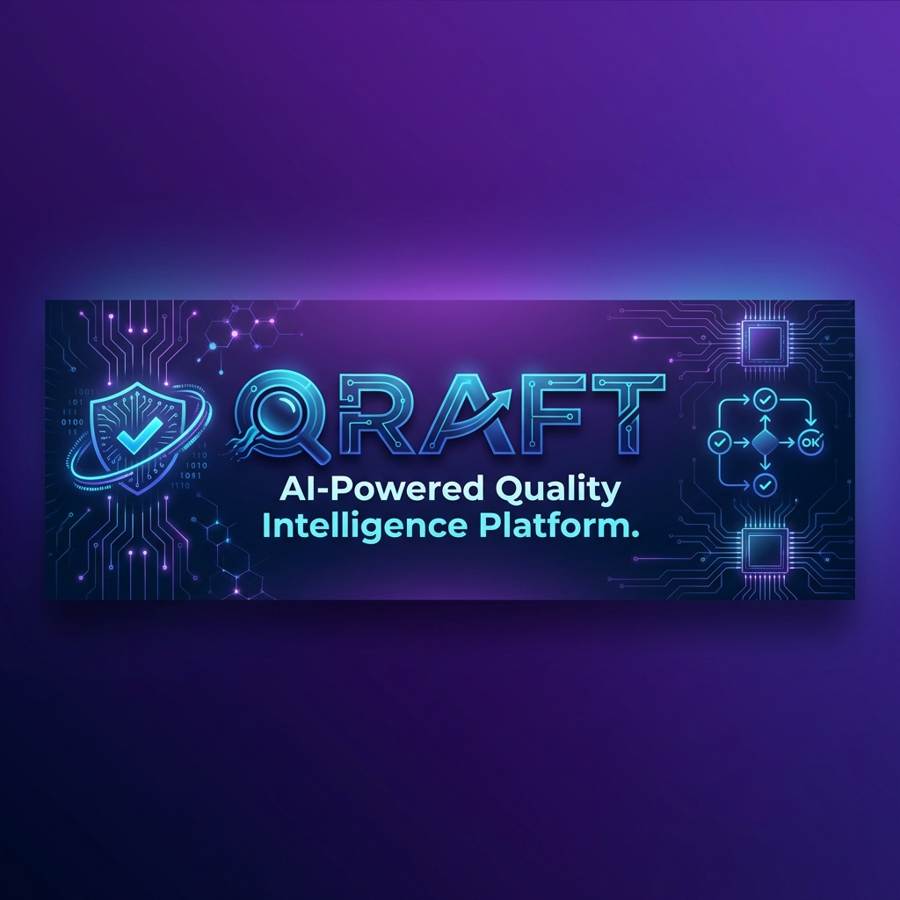

<p align="center">
  
</p>

<p align="center">
  <strong>The Next-Generation Testing Platform That Thinks Like a QA Engineer</strong>
</p>

<p align="center">
  <a href="#-key-features">Features</a> •
  <a href="#-quick-start">Quick Start</a> •
  <a href="#-demo">Demo</a> •
  <a href="#-documentation">Docs</a> •
  <a href="#-roadmap">Roadmap</a>
</p>

---

## 🎯 What is QRAFT?

**QRAFT** (Quality + Craft) is an **AI-powered Quality Intelligence Platform** that transforms how teams approach testing. Unlike traditional testing tools, QRAFT doesn't just automate tests—it **understands** them.

### The Problem We Solve

- ❌ **Playwright/Selenium**: Requires coding expertise, brittle selectors, manual maintenance
- ❌ **Traditional QA Tools**: Time-consuming test creation, no intelligence, expensive
- ❌ **Manual Testing**: Slow, error-prone, doesn't scale

### The QRAFT Solution

- ✅ **Natural Language → Tests**: Describe what to test, AI generates the steps
- ✅ **Self-Healing Tests**: Broken selectors? AI fixes them automatically
- ✅ **Flakiness Intelligence**: Understand *why* tests fail, not just *that* they fail
- ✅ **Living Documentation**: Tests become up-to-date user guides
- ✅ **No Coding Required**: QA engineers, PMs, anyone can create tests

---

## 🚀 Key Features

### 1. 🤖 AI Test Generation
```
You: "Test that users can login with valid credentials and see their dashboard"

QRAFT: ✨ Generates complete test scenario in 10 seconds
```

**20-30x faster** than manual test creation!

### 2. 🔧 Self-Healing Selectors
When your UI changes, QRAFT automatically:
- Detects broken selectors
- Finds the correct element using AI
- Updates the test
- Notifies you of the fix

**Zero maintenance** for UI changes!

### 3. 💎 Flakiness Intelligence
QRAFT doesn't just report "Test Failed"—it tells you:
- "Fails every Monday 9am" → Server restart issue
- "Fails on Chrome, passes on Firefox" → Browser compatibility
- "Fails after deploy abc123" → Regression in commit

**Actionable insights**, not just error logs!

### 4. 📚 Living Documentation
Your tests automatically become:
- User guides with screenshots
- Onboarding tutorials
- API documentation
- Always up-to-date

**Documentation that never goes stale!**

### 5. 🎨 Beautiful UI
Built with **Filament PHP**, QRAFT offers:
- Intuitive dashboard
- Real-time test execution
- Visual step-by-step results
- Team collaboration features

---

## ⚡ Quick Start

### Prerequisites
- PHP 8.2+
- Composer
- Node.js 18+
- MySQL/PostgreSQL

### Installation

```bash
# Clone the repository
git clone https://github.com/yourusername/qraft.git
cd qraft

# Install dependencies
composer install
npm install

# Setup environment
cp .env.example .env
php artisan key:generate

# Run migrations
php artisan migrate

# Seed demo data (optional but recommended!)
php artisan db:seed --class=DemoDataSeeder

# Start the application
php artisan serve
```

Visit `http://localhost:8000` and login with demo credentials!

---

## 🎬 Demo

### Creating a Test with AI

1. **Navigate to Test Scenarios**
2. **Click "🤖 Generate Steps"**
3. **Describe your test**:
   ```
   Test user registration flow:
   - Visit signup page
   - Fill in email, password, name
   - Submit form
   - Verify welcome message appears
   ```
4. **AI generates complete test** in seconds!
5. **Run immediately** or schedule for later

### Running Tests

```bash
# Run all tests for a project
php artisan qraft:run --project="My App"

# Run specific scenario
php artisan qraft:run --scenario=123

# Schedule recurring tests
# (Configure in UI: hourly, daily, weekly)
```

---

## 🏗️ Architecture

```
┌─────────────────────────────────────────────────┐
│              QRAFT Platform                     │
├─────────────────────────────────────────────────┤
│  Filament UI  │  AI Services  │  Test Engine   │
│  (Dashboard)  │  (Gemini API) │  (Playwright)  │
├─────────────────────────────────────────────────┤
│         Laravel Backend + Queue System          │
├─────────────────────────────────────────────────┤
│      Inspector Service (Headless Browser)       │
└─────────────────────────────────────────────────┘
```

**Tech Stack**:
- **Backend**: Laravel 11, Filament 3
- **AI**: Google Gemini API
- **Browser Automation**: Playwright (via Node.js Inspector Service)
- **Queue**: Redis/Database
- **Database**: MySQL/PostgreSQL

---

## 📖 Documentation

- **[Installation Guide](docs/INSTALLATION.md)** - Complete setup for all platforms
- **[Contributing Guide](docs/CONTRIBUTING.md)** - How to contribute
- **[Product Roadmap](docs/ROADMAP.md)** - Future plans
- **[Documentation Index](docs/DOCUMENTATION_INDEX.md)** - All docs
- **[Herd Setup](docs/SETUP_HERD.md)** - macOS with Laravel Herd
- **[Laragon Setup](docs/SETUP_LARAGON.md)** - Windows with Laragon

---

## 🗺️ Roadmap

### ✅ Completed
- [x] AI Test Generation
- [x] Self-Healing Selectors
- [x] Test Execution Engine
- [x] Filament Dashboard
- [x] Inspector Service Integration

### 🚧 In Progress
- [ ] Chrome Extension Recorder
- [ ] Flakiness Intelligence Dashboard
- [ ] Living Documentation Generator

### 🔮 Planned
- [ ] Multi-browser support (Firefox, Safari)
- [ ] Visual regression testing
- [ ] Performance testing integration
- [ ] Team collaboration features
- [ ] Marketplace for test templates

[View Full Roadmap →](docs/roadmap.md)

---

## 🤝 Contributing

We welcome contributions! Please see our [Contributing Guide](CONTRIBUTING.md) for details.

### Development Setup

```bash
# Install dev dependencies
composer install --dev
npm install --dev

# Run tests
php artisan test

# Run linter
./vendor/bin/pint

# Run type checker
./vendor/bin/phpstan analyse
```

---

## 📊 Comparison

| Feature | Playwright | Selenium | Cypress | **QRAFT** |
|---------|-----------|----------|---------|-----------|
| AI Test Generation | ❌ | ❌ | ❌ | ✅ |
| Self-Healing | ❌ | ❌ | ❌ | ✅ |
| No Coding Required | ❌ | ❌ | ❌ | ✅ |
| Flakiness Intelligence | ❌ | ❌ | ❌ | ✅ |
| Living Documentation | ❌ | ❌ | ❌ | ✅ |
| Beautiful UI | ❌ | ❌ | ⚠️ | ✅ |
| Multi-browser | ✅ | ✅ | ⚠️ | 🚧 |
| Open Source | ✅ | ✅ | ✅ | ✅ |

---

## 💰 Pricing

QRAFT is **free and open-source** under the MIT license!

**Enterprise Support** available for:
- Priority support
- Custom integrations
- On-premise deployment
- SLA guarantees

[Contact us](mailto:support@qraft.dev) for enterprise pricing.

---

## 🌟 Why QRAFT?

> "QRAFT reduced our test creation time from 2 hours to 5 minutes. The AI is incredible!"  
> — **Sarah Chen**, QA Lead at TechCorp

> "Self-healing selectors saved us countless hours of maintenance. Game-changer!"  
> — **Mike Rodriguez**, Engineering Manager at StartupXYZ

> "Finally, a testing tool that non-technical team members can use!"  
> — **Emily Watson**, Product Manager at SaaS Inc.

---

## 📝 License

QRAFT is open-source software licensed under the [MIT license](LICENSE).

---

## 🙏 Acknowledgments

Built with amazing open-source projects:
- [Laravel](https://laravel.com)
- [Filament](https://filamentphp.com)
- [Playwright](https://playwright.dev)
- [Google Gemini](https://ai.google.dev)

---

## 📧 Contact

- **Website**: [qraft.dev](https://qraft.dev)
- **Email**: [hello@qraft.dev](mailto:hello@qraft.dev)
- **Twitter**: [@QraftHQ](https://twitter.com/QraftHQ)
- **Discord**: [Join our community](https://discord.gg/qraft)

---

<p align="center">
  Made with ❤️ by the QRAFT Team
</p>

<p align="center">
  <a href="https://github.com/yourusername/qraft/stargazers">⭐ Star us on GitHub</a> •
  <a href="https://github.com/yourusername/qraft/issues">🐛 Report Bug</a> •
  <a href="https://github.com/yourusername/qraft/issues">💡 Request Feature</a>
</p>
